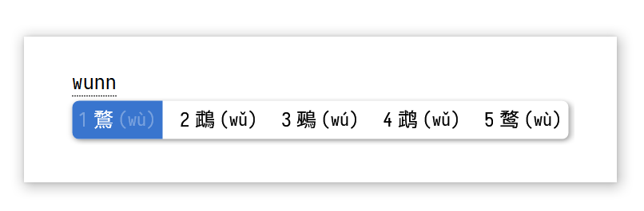
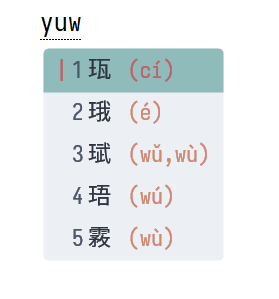

## 概述

用拼音输入一个汉字的每一个组成部分（偏旁、部首等部件），组合拼出字来。

例如：

1. 输入 `kou kou ma`（口 口 马）或者 `wang ma`（罒 馬）得 `骂（罵）`
2. 输入 `wu niao`（敄 鸟）或者 `mao wen niao`（矛 夂 鸟）得 `鹜`



适配双拼（上图为小鹤双拼）

## 安装

下载以下两个文件

- radical_pinyin.dict.yaml
- radical_pinyin.schema.yaml

复制到 Rime 用户目录

双拼用户请手动修改 algebra 的 __include 部分

## 反查

在目标输入方案的如下部分写入信息：

```yaml
# apply to example.schema.yaml
schema:
    dependencies:
        - radical_pinyin
    segmentors:
        - affix_segmentor@radical_lookup
    translators:
        - table_translator@radical_lookup
    filters:
        - reverse_lookup_filter@radical_reverse_lookup
    radical_reverse_lookup:
        tags: [ radical_lookup ]
        overwrite_comment: true 
        dictionary: example # 提示码词表
        comment_format:
            - xform/^/(/
            - xform/$/)/
    radical_lookup:
        tag: radical_lookup
        dictionary: radical_pinyin
        prefix: 'u'
        tips: "[拆字]"
        # closing_tips:
        suffix: "'"
        comment_format:
            - erase/^.*$//
    recognizer:
        patterns:
            radical_lookup: "u[a-z]+'?$"
```

按 `u` 引导拆字，效果：



Release 页面下，有一个 `example.schema.yaml` 可以提供参考。

## 拆字码表

码表：[chazi](https://github.com/kfcd/chaizi) 

添补 [henrysting](https://github.com/henrysting/chaizi/)

校对、添补：[Mirtle](https://github.com/mirtlecn)

该码表采用 [CC BY 3.0 DEED](https://creativecommons.org/licenses/by/3.0/) 授权条款

更改：

- 合并了繁简两份码表，合入了 henrysting 的添补
- 和 8015 个常用汉字比对，加入了 200 多未收录的常用字
- 更正了大量拆法
- 删除了不能正常显示的汉字
- 手动添补了一些原来没有的拆字
- 加入一些其他拆法和汉字（如二叠字）

## 输入方案

by Mirtle

许可证 [LGPL](LICENSE.txt)

## 注音要点

- 普通汉字：读本音
- 生僻字：确实为常用的独立汉字的，保留生僻字读音
- 笔画：笔画读音（勾，点，横，竖，撇，捺）
- 多音字：一般保留最常用读音，都常用则同时保留
- 无读音的偏旁：使用学前教育时使用的助记法标音

以上读音可以同时存在，因而一个部件可能有多种拼法。
- 冂（本音 jiong、助记 tong）
- 一（本音 yi、笔画 heng）

```yaml
# '廾': [['gong4','nong4']],
# '一': [['heng2','yi1']],
# '灬': [['huo3']],
# '丿': [['pie3']],
# '丨': [['shu4']],
# '乁': [['na4']],
# '㇏': [['na4']],
# '⺄': [['yi3']], # 「乙」的变体（「虱」的外包围）
# '𠃊': [['zhe2']],
# '𠙽': [['kuai4']],
# '𦉼': [['la4']],
# '𭕘': [['mei2']],
# '𣥚': [['zou3']],
# '𤽄': [['quan2']],
# '疋': [['ding4','pi3','shu1','ya2']],
# '乚': [['gou1']],
# '亅': [['gou1']],
# '𠄌': [['gou1']],
# '凵': [['kan3']],
# '冖': [['mi4','bao3']],
# '攵': [['wen2']],
# '𠃌': [['zhe2','gou1']],
# '夂': [['wen2']],
# '冂': [['tong2','jiong1']],
# '丶': [['dian3']],
# '乛': [['zhe2']],
# '㇆': [['zhe2']],
# '𡗗': [['chun1']],
# '乀': [['na4']],
# '𠃋': [['zhe2']],
# '龴': [['yu3', 'si1']],
# '㇉': [['zhe2']],
# '⺆': [['ji3']],
# '□': [['ge1']],
# '': [['yi1']], # 「衣」去掉 亠 的下部，以及再去掉丿的变体（「展」的下部）
# '卩': [['er3']],
# '廴': [['jian4']],
# '宀': [['bao3']],
# '龷': [['gong4']],
# '□': [['zhe2']],
# '𡕩': [['man3']],
# '罒': [['si4','wang3']],
# '癶': [['deng1']],
# '𠃍': [['zhe2']],
# '爫': [['zhua3','zhao3']],
# '彳': [['ren2','chi4']],
# '阝': [['er3']],
# '匚': [['fang1','kuang1']],
# '彐': [['shan1']],
# '刂': [['dao1']],
# '丬': [['jiang1','qiang2']],
# '囗': [['kou3','wei2','guo2']], # 国，围等字的外框
# '辶': [['zou3','zhi1']],
# '彡': [['shan1','san1']],
# '𦣞': [['yi2']]
```

## 反查带声调注音

将提示码的词典指向一个带声调的词典即可。

您也可以：

在 Release 下的压缩包内，build 目录下有两个编译好的词典，可以复制进 build 目录，更改提示码词典指向它们。

- `char.reverse.bin`: 单字注最常用的一到两个读音
- `all_char.reverse.bin`: 单字注所有可能的读音

## 已知问题

如果您为此方案开启用户词典，输入过的字可能不会经过算法处理，从而使其输入码出现问题。不影响正常输入。

如果想解决这个问题，你可以考虑将词典的所有条目删除 ' 号（并转换为双拼编码）

## 问题

请提交 issue
